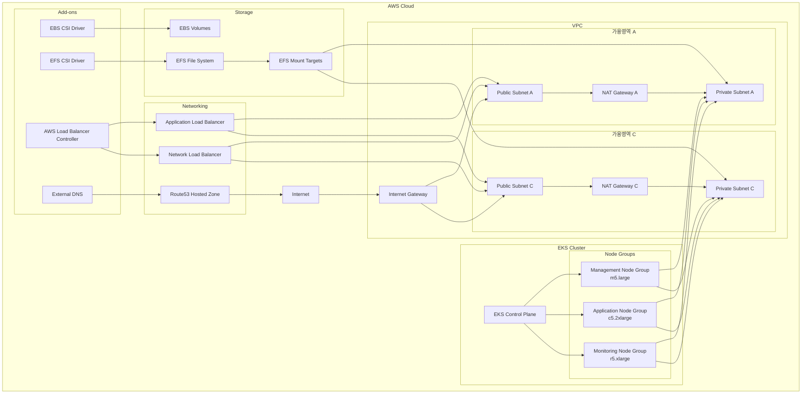
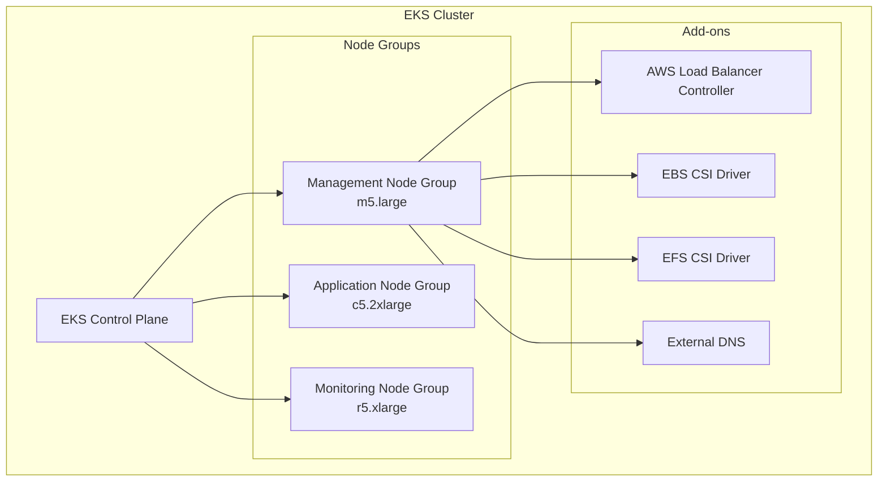
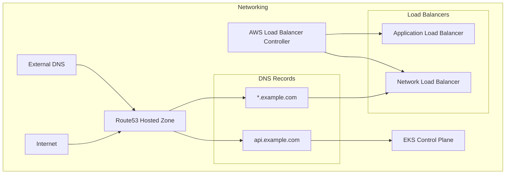
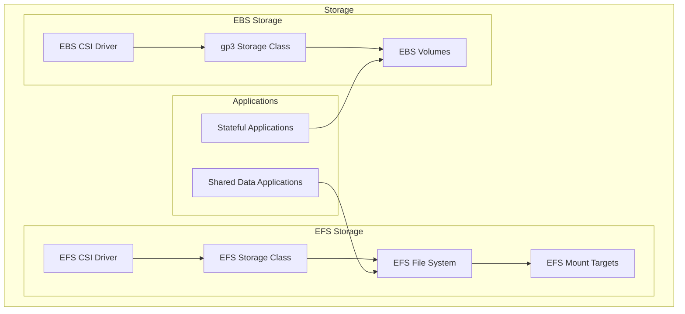
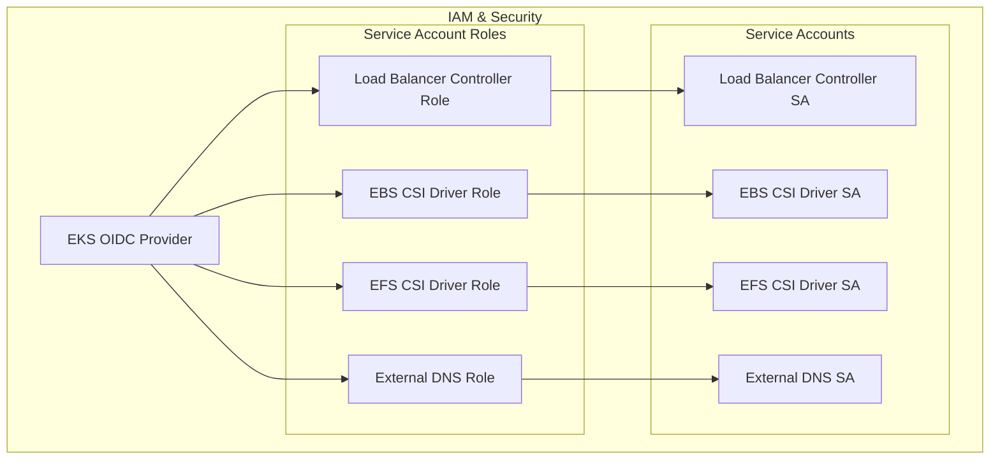
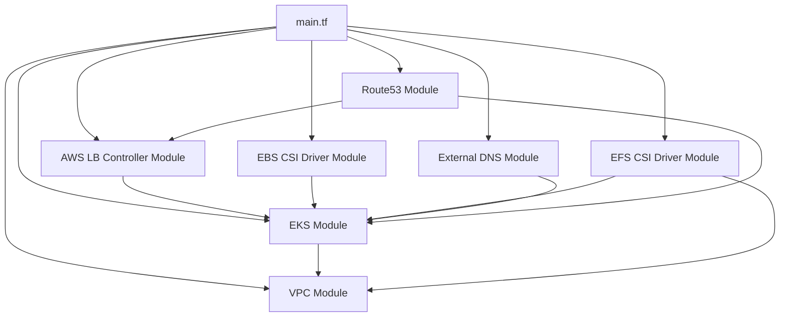

# EKS 클러스터 인프라 다이어그램

## 전체 아키텍처 다이어그램

```mermaid
graph TD
    subgraph "AWS Cloud"
        subgraph "VPC"
            subgraph "가용영역 A"
                PublicSubnetA["Public Subnet A"]
                PrivateSubnetA["Private Subnet A"]
                NATA["NAT Gateway A"]
                PublicSubnetA --> NATA
                NATA --> PrivateSubnetA
            end
            
            subgraph "가용영역 C"
                PublicSubnetC["Public Subnet C"]
                PrivateSubnetC["Private Subnet C"]
                NATC["NAT Gateway C"]
                PublicSubnetC --> NATC
                NATC --> PrivateSubnetC
            end
            
            IGW["Internet Gateway"]
            IGW --> PublicSubnetA
            IGW --> PublicSubnetC
        end
        
        subgraph "EKS Cluster"
            ControlPlane["EKS Control Plane"]
            
            subgraph "Node Groups"
                ManagementNG["Management Node Group\nm5.large"]
                ApplicationNG["Application Node Group\nc5.2xlarge"]
                MonitoringNG["Monitoring Node Group\nr5.xlarge"]
            end
            
            ControlPlane --> ManagementNG
            ControlPlane --> ApplicationNG
            ControlPlane --> MonitoringNG
        end
        
        subgraph "Add-ons"
            LBController["AWS Load Balancer Controller"]
            EBSDriver["EBS CSI Driver"]
            EFSDriver["EFS CSI Driver"]
            ExternalDNS["External DNS"]
        end
        
        subgraph "Storage"
            EBS["EBS Volumes"]
            EFS["EFS File System"]
            EFSMountTargets["EFS Mount Targets"]
            
            EBSDriver --> EBS
            EFSDriver --> EFS
            EFS --> EFSMountTargets
            EFSMountTargets --> PrivateSubnetA
            EFSMountTargets --> PrivateSubnetC
        end
        
        subgraph "Networking"
            ALB["Application Load Balancer"]
            NLB["Network Load Balancer"]
            Route53["Route53 Hosted Zone"]
            
            LBController --> ALB
            LBController --> NLB
            ExternalDNS --> Route53
        end
        
        ManagementNG --> PrivateSubnetA
        ManagementNG --> PrivateSubnetC
        ApplicationNG --> PrivateSubnetA
        ApplicationNG --> PrivateSubnetC
        MonitoringNG --> PrivateSubnetA
        MonitoringNG --> PrivateSubnetC
        
        ALB --> PublicSubnetA
        ALB --> PublicSubnetC
        NLB --> PublicSubnetA
        NLB --> PublicSubnetC
        
        Internet["Internet"]
        Internet --> IGW
        Route53 --> Internet
    end
```

## EKS 클러스터 구성 요소

```mermaid
graph TD
    subgraph "EKS Cluster"
        ControlPlane["EKS Control Plane"]
        
        subgraph "Node Groups"
            ManagementNG["Management Node Group\nm5.large"]
            ApplicationNG["Application Node Group\nc5.2xlarge"]
            MonitoringNG["Monitoring Node Group\nr5.xlarge"]
        end
        
        subgraph "Add-ons"
            LBController["AWS Load Balancer Controller"]
            EBSDriver["EBS CSI Driver"]
            EFSDriver["EFS CSI Driver"]
            ExternalDNS["External DNS"]
        end
        
        ControlPlane --> ManagementNG
        ControlPlane --> ApplicationNG
        ControlPlane --> MonitoringNG
        
        ManagementNG --> LBController
        ManagementNG --> EBSDriver
        ManagementNG --> EFSDriver
        ManagementNG --> ExternalDNS
    end
```

## 네트워킹 구성

```mermaid
graph TD
    subgraph "Networking"
        Route53["Route53 Hosted Zone"]
        ExternalDNS["External DNS"]
        LBController["AWS Load Balancer Controller"]
        
        subgraph "Load Balancers"
            ALB["Application Load Balancer"]
            NLB["Network Load Balancer"]
        end
        
        subgraph "DNS Records"
            APIRecord["api.example.com"]
            WildcardRecord["*.example.com"]
        end
        
        Internet["Internet"]
        
        ExternalDNS --> Route53
        LBController --> ALB
        LBController --> NLB
        
        Route53 --> APIRecord
        Route53 --> WildcardRecord
        
        APIRecord --> ControlPlane["EKS Control Plane"]
        WildcardRecord --> NLB
        
        Internet --> Route53
    end
```

## 스토리지 구성

```mermaid
graph TD
    subgraph "Storage"
        subgraph "EBS Storage"
            EBSDriver["EBS CSI Driver"]
            EBSStorageClass["gp3 Storage Class"]
            EBSVolumes["EBS Volumes"]
            
            EBSDriver --> EBSStorageClass
            EBSStorageClass --> EBSVolumes
        end
        
        subgraph "EFS Storage"
            EFSDriver["EFS CSI Driver"]
            EFSStorageClass["EFS Storage Class"]
            EFSFileSystem["EFS File System"]
            EFSMountTargets["EFS Mount Targets"]
            
            EFSDriver --> EFSStorageClass
            EFSStorageClass --> EFSFileSystem
            EFSFileSystem --> EFSMountTargets
        end
        
        subgraph "Applications"
            StatefulApps["Stateful Applications"]
            SharedApps["Shared Data Applications"]
        end
        
        StatefulApps --> EBSVolumes
        SharedApps --> EFSFileSystem
    end
```

## IAM 및 보안 구성

```mermaid
graph TD
    subgraph "IAM & Security"
        OIDC["EKS OIDC Provider"]
        
        subgraph "Service Account Roles"
            LBControllerRole["Load Balancer Controller Role"]
            EBSDriverRole["EBS CSI Driver Role"]
            EFSDriverRole["EFS CSI Driver Role"]
            ExternalDNSRole["External DNS Role"]
        end
        
        subgraph "Service Accounts"
            LBControllerSA["Load Balancer Controller SA"]
            EBSDriverSA["EBS CSI Driver SA"]
            EFSDriverSA["EFS CSI Driver SA"]
            ExternalDNSSA["External DNS SA"]
        end
        
        OIDC --> LBControllerRole
        OIDC --> EBSDriverRole
        OIDC --> EFSDriverRole
        OIDC --> ExternalDNSRole
        
        LBControllerRole --> LBControllerSA
        EBSDriverRole --> EBSDriverSA
        EFSDriverRole --> EFSDriverSA
        ExternalDNSRole --> ExternalDNSSA
    end
```

## 모듈 의존성 다이어그램

```mermaid
graph TD
    Main["main.tf"]
    
    VPC["VPC Module"]
    EKS["EKS Module"]
    LBController["AWS LB Controller Module"]
    EBSDriver["EBS CSI Driver Module"]
    EFSDriver["EFS CSI Driver Module"]
    ExternalDNS["External DNS Module"]
    Route53["Route53 Module"]
    
    Main --> VPC
    Main --> EKS
    Main --> LBController
    Main --> EBSDriver
    Main --> EFSDriver
    Main --> ExternalDNS
    Main --> Route53
    
    EKS --> VPC
    LBController --> EKS
    EBSDriver --> EKS
    EFSDriver --> EKS
    ExternalDNS --> EKS
    Route53 --> EKS
    
    EFSDriver --> VPC
    Route53 --> LBController
```